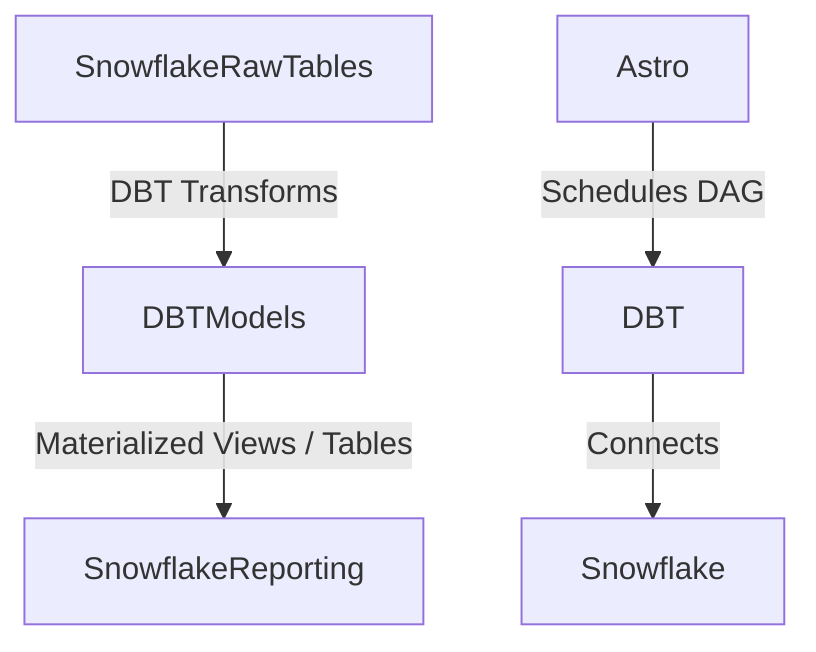

# 🛰️ Snowflake Data Pipeline — Astro | DBT | Airflow

A modern, cloud-first data pipeline using **Apache Airflow (Astro)** for orchestration, **DBT** for SQL-based transformations, and **Snowflake** as the cloud data warehouse. This solution schedules and transforms Snowflake data into clean, analytics-ready layers on a daily basis.

---

## 💡 Project Overview

This pipeline:
- Schedules and orchestrates dbt models using Airflow DAGs
- Transforms raw data from Snowflake using modular SQL models in DBT
- Structures data into reporting-ready layers for downstream analytics tools

---

## 🤖 Why These Tools?

| Tool       | Why it’s used                                                                 |
|------------|--------------------------------------------------------------------------------|
| **Astro** (Airflow) | Manages job orchestration and ensures workflows run on schedule and are recoverable. |
| **DBT**     | Powers transformation logic in SQL with version control and dependency management. |
| **Snowflake**| Serves as the cloud-native data warehouse that integrates cleanly with DBT and scales easily. |

---

## 📡 Architecture



---

## 📂 Directory Structure

```
snowflake-dbt-pipeline/
│
├── dags/
│   └── dbt_dag.py                # Airflow DAG configuration using Cosmos
│
├── models/                       # DBT SQL model files
│   ├── models.sql
│   ├── pricing.sql
│   └── snowflake.sql
│
├── dbt_project.yml               # DBT project configuration
└── README.md
```

---

## 🧱 DBT Models

### `models.sql`
Defines the base and intermediate models, for example:

```sql
WITH base_orders AS (
    SELECT * FROM {{ source('raw', 'orders') }}
),
filtered_orders AS (
    SELECT * FROM base_orders WHERE status = 'completed'
)
SELECT * FROM filtered_orders;
```

### `pricing.sql`

```sql
SELECT 
    product_id,
    price,
    discount,
    price - discount AS final_price
FROM {{ ref('products') }};
```

### `snowflake.sql`

```sql
SELECT
    customer_id,
    first_name,
    last_name,
    created_at
FROM snowflake.account.customers;
```

These models follow dbt conventions using `ref()` and `source()` to build DAG dependencies.

---

## 🌀 Airflow DAG

### `dbt_dag.py`

```python
from datetime import datetime
from cosmos import DbtDag, ProjectConfig, ProfileConfig, ExecutionConfig
from cosmos.profiles import SnowflakeUserPasswordProfileMapping

# DBT profile configuration using Snowflake credentials
profile_config = ProfileConfig(
    profile_name="default",
    target_name="dev",
    profile_mapping=SnowflakeUserPasswordProfileMapping(
        conn_id="snowflake_conn",
        profile_args={"database": "dbt_db", "schema": "dbt_schema"},
    )
)

# DAG definition
dbt_snowflake_dag = DbtDag(
    dag_id="dbt_dag",
    project_config=ProjectConfig("/usr/local/airflow/dags/dbt/data_pipeline"),
    profile_config=profile_config,
    execution_config=ExecutionConfig(dbt_executable_path="/home/astro/.local/bin/dbt"),
    operator_args={"install_deps": True},
    schedule_interval="@daily",
    start_date=datetime(2025, 2, 28),
    catchup=False,
)
```

### Key Components:
- **Snowflake Connection ID:** `snowflake_conn` (must be set in Airflow UI)
- **DBT Executable Path:** Points to the dbt binary in the Docker container
- **Profile Args:** Snowflake database and schema for dbt to target

---

## ⚙️ Setup Instructions

### 🔧 Prerequisites

- Python 3.8+
- Docker
- Astro CLI (`npm install -g astro`)
- Snowflake account and Airflow connection

### 1️⃣ Clone the Repo

```bash
git clone https://github.com/your-user/snowflake-dbt-pipeline.git
cd snowflake-dbt-pipeline
```

### 2️⃣ Set up Airflow Connection

In the Airflow UI:
- Go to Admin → Connections → Add
- Conn Id: `snowflake_conn`
- Conn Type: Snowflake
- Fill in account, user, password, role, warehouse, database, and schema

---

## 🚀 Run the Pipeline (Locally)

### Start Astro Environment

```bash
astro dev start
```

Access the Airflow UI at: [http://localhost:8080](http://localhost:8080)

---

## 🧠 Run DBT Models Manually

```bash
astro dev bash
dbt debug
dbt run --profiles-dir . --project-dir .
```

You can also test specific models:
```bash
dbt run --select pricing snowflake
```

---

## 🔐 Security Best Practices

- Use Airflow Connections for managing secrets
- Avoid committing credentials to version control
- Use Snowflake RBAC and separate roles for dbt and analytics

---

## 📌 License

MIT License. Use, modify, and distribute freely.
